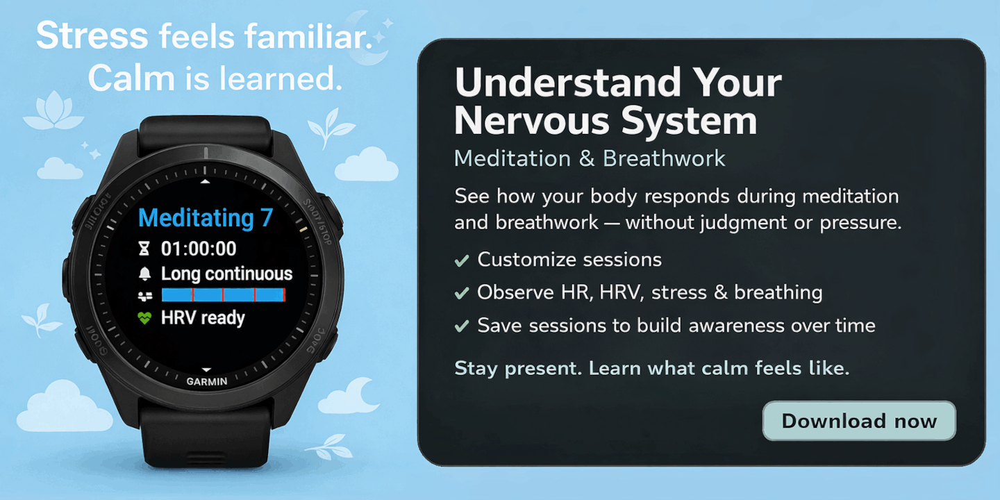

<small>🌐 <a href="/meditate_app/">English</a> | <a href="/meditate_app-de/">Deutsch</a> | <a href="/meditate_app-es/">Español</a> | <a href="/meditate_app-fr/">Français</a> | <b>日本語</b> | <a href="/meditate_app-ko/">한국어</a> | <a href="/meditate_app-pt/">Português</a> | <a href="/meditate_app-uk/">Українська</a> | <a href="/meditate_app-zh/">中文</a></small>

落ち着いているのに、どこか不安でもある。そんなふうに感じたことがあっても、おかしくありません。とても人間らしいことです。

長いあいだ生活の負荷が高いと、神経系は警戒を続けることを覚えます。ストレスは慣れた状態になり、落ち着きはむしろ慣れない状態になります。だからこそ、落ち着きに向かう感覚が最初は少し心細く感じられたり、そわそわしたりすることがあります。これは直すべき問題ではなく、神経系が知っている状態に適応しているだけです。

**瞑想 & 呼吸法**は、身体とのつながりを取り戻しながら、神経系がどう反応しているかをリアルタイムで観察するのに役立ちます。

**アプリを入手:** [瞑想 & 呼吸法をダウンロード](https://apps.garmin.com/apps/e6f3f3d2-3ea6-4ec1-81a5-977c708eb75b)

**はじめ方:** [ユーザーガイドを読む](https://geigl.online/meditate_app_user_guide/)

---

## 実践を通して神経系を理解する

瞑想 & 呼吸法は、瞑想や呼吸法を、今ここにいる感覚と身体の気づきとともに支える Garmin ウォッチアプリです。マインドフルネスとリアルタイムの生体データを組み合わせることで、評価やプレッシャーなしに、自分の身体がどう働いているかを理解しやすくなります。

すべての人に合うひとつの瞑想法はありません。  
大切なのは、**自分の** 神経系にとって何が助けになるかを見つけることです。

---

## 自分に合わせて続けられる実践

- 自分のリズムや集中力に合うセッションを作れる
- 心拍数、HRV、ストレス、呼吸をリアルタイムで見られる
- セッションを Garmin Connect に保存して、無理なく継続と気づきを育てられる

時間をかけてセッションを振り返ることは、義務感や成果のためではありません。  
自分のパターンに気づき、慣れを育て、自分で選んだ実践を忘れずに続けやすくするためです。

---

## 調整が進むことは、いつも穏やかさだけを意味しない

瞑想や呼吸ワークの目的は、"良い" 数値を出すことではありません。

落ち着いたセッションに価値があるのは、神経系が調整された状態により長くとどまれるからです。そこにいる時間が長いほど、そのための神経経路が強まり、時間とともに落ち着きやバランスに戻りやすくなります。

その一方で、落ち着きに向かう途中で、そわそわしたり、急に立ち上がって何かしたくなったりすることもあります。これはしばしば、心が慣れた状態であるストレスや活動、動きのほうへ戻そうとしている反応です。慣れているもののほうが安全に感じられるからです。

そんな瞬間は、少し軽やかに受け止めてみてください。  
_「ああ、また来たね。混乱が恋しいんだね。ずいぶん抜け目ない心だな。」_

ストレスが高いセッションにも価値があります。ストレスが高いままということは、不快さにすぐ反応せず、その場にとどまれたという意味であることがよくあります。起きていることを見守り、身体が自分のペースで落ち着くのを許したのです。これは、生活が大変なときでも地に足をつけていられる力を育てます。

どちらのタイプのセッションも、調整を助けてくれます。  
ただ、鍛えている力が違うだけです。

だからセッションは数値だけで判断すべきではありません。けれど同時に、だからこそ数値は役に立ちます。自分がどんな状態にいたのかを示し、その状態が身体の内側でどう感じられるのかに気づきやすくしてくれるからです。時間がたつほど、身体との再接続が深まり、より意識的な選択を支えてくれます。

---

## なぜトラッキングが役立つのか

ストレス、心拍数、心拍変動といった生理的なサインを追うことで、瞑想や呼吸ワークのあいだに神経系がどう反応しているかを知る手がかりになります。一般的に HRV が高いほど、より落ち着いた調整状態や神経系の柔軟さと結びつきやすく、HRV が低いほど、活性化やストレスを反映していることが多いです。

こうした指標は点数ではなく、文脈を与えてくれます。パターンに気づき、身体感覚を深め、どの実践が自分の中に何を引き起こすのかを理解する助けになります。

トラッキングは、コントロールや最適化のためではありません。  
自分の神経系がどうやってバランスを見つけるのかを学ぶためのものです。

---

## 今いる場所から始める

今ここにいて、正直に観察する。  
心がまたうまくやろうとしてきたら、少し笑ってみる。

[瞑想 & 呼吸法をダウンロード](https://apps.garmin.com/apps/e6f3f3d2-3ea6-4ec1-81a5-977c708eb75b)して、自分の瞑想や呼吸ワークを本当に支えてくれるものを、1 セッションずつ見つけていきましょう。

機能やよくある質問、サポートの詳細は[ユーザーガイド](https://geigl.online/meditate_app_user_guide/)をご覧ください。
