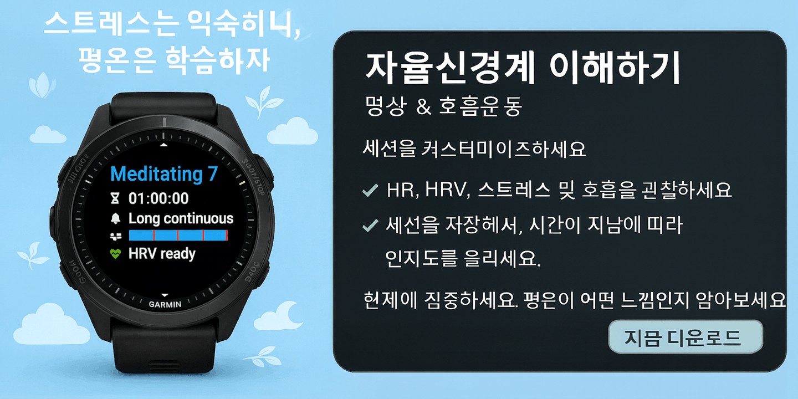

<small>🌐 <a href="/meditate_app/">English</a> | <a href="/meditate_app-de/">Deutsch</a> | <a href="/meditate_app-es/">Español</a> | <a href="/meditate_app-fr/">Français</a> | <a href="/meditate_app-ja/">日本語</a> | <b>한국어</b> | <a href="/meditate_app-pt/">Português</a> | <a href="/meditate_app-uk/">Українська</a> | <a href="/meditate_app-zh/">中文</a></small>

차분하면서도 동시에 불안했던 적이 있다면, 당신에게 문제가 있는 게 아닙니다. 그저 인간적인 반응입니다.

삶이 오랫동안 버거웠다면 신경계는 계속 경계하는 법을 배웁니다. 스트레스는 익숙해지고, 평온함은 낯설어집니다. 그래서 낯선 평온은 처음엔 약간 불편하거나 취약하게 느껴질 수 있습니다. 고쳐야 할 문제가 아닙니다. 신경계가 익숙한 것에 적응하는 자연스러운 방식일 뿐입니다.

**명상 & 호흡 훈련**은 몸과 다시 연결되고, 신경계가 어떻게 반응하는지 실시간으로 알아차릴 수 있게 도와줍니다.

**앱 받기:** [명상 & 호흡 훈련 다운로드](https://apps.garmin.com/apps/e6f3f3d2-3ea6-4ec1-81a5-977c708eb75b)

**시작하기:** [사용자 가이드 읽기](https://geigl.online/meditate_app_user_guide/)

---

## 연습을 통해 내 신경계를 이해하기

명상 & 호흡 훈련은 명상과 호흡 훈련을 돕기 위해 만든 Garmin 시계 앱입니다. 현재에 머무름, 통찰, 생리적 자각을 바탕으로 하며, 마음챙김과 실시간 생체 데이터를 함께 보여 줍니다. 그래서 스스로를 평가하거나 압박하지 않고도 몸이 어떻게 반응하는지 이해할 수 있습니다.

모든 사람에게 맞는 하나의 명상법은 없습니다.  
중요한 건 **내** 신경계를 도와주는 방식을 찾는 것입니다.

---

## 나에게 맞춰지는 연습

- 내 리듬과 집중력에 맞는 세션 만들기
- 심박수, HRV, 스트레스, 호흡을 실시간으로 관찰하기
- Garmin Connect에 세션을 저장해 꾸준함과 자각을 부드럽게 이어가기

시간이 지나며 세션을 돌아보는 일은 훈련 성과를 따지는 게 아닙니다.  
패턴을 알아차리고, 익숙함을 쌓고, 스스로 선택한 연습을 계속 의식하도록 도와줄 뿐입니다.

---

## 조절은 항상 평온함만을 뜻하지 않습니다

명상 & 호흡 훈련의 목적은 "좋은" 수치를 만드는 데 있지 않습니다.

차분한 세션이 소중한 이유는 신경계가 더 오래 조절된 상태에 머물 수 있기 때문입니다. 그 상태에 오래 머물수록 관련 신경 경로가 더 강화되어, 시간이 갈수록 평온함과 균형에 더 쉽게 접근할 수 있습니다.

동시에 평온 쪽으로 가는 과정에서 안절부절못함이나 갑자기 일어나 뭔가 하고 싶은 충동이 올라올 수도 있습니다. 익숙한 것이 안전하게 느껴지기 때문에, 마음이 스트레스와 활동, 움직임 쪽으로 다시 데려가려는 경우가 많습니다.

그럴 때는 가볍게 알아차려도 됩니다:  
_“아, 또 왔네. 너는 혼란이 그립구나. 참 교묘한 마음이네.”_

스트레스가 높은 세션도 가치가 있습니다. 스트레스가 계속 높게 남아 있다면, 대개 불편함에 바로 반응하지 않고 그 자리에 머물렀다는 뜻입니다. 일어나는 일을 지켜보고, 몸이 자기 시간에 맞게 가라앉도록 두었다는 의미입니다. 이런 경험은 삶이 버거울 때도 중심을 잃지 않는 힘을 길러 줍니다.

두 종류의 세션 모두 조절 능력을 키워 줍니다.  
그저 훈련하는 기술이 다를 뿐입니다.

그래서 세션을 수치만으로 판단하면 안 됩니다. 하지만 바로 그렇기 때문에 수치가 도움이 되기도 합니다. 내가 어떤 상태에 있었는지 보여 주고, 그 상태가 몸 안에서 어떻게 느껴지는지 더 잘 알아차리게 해 주기 때문입니다. 시간이 지나면 이런 과정이 몸과의 다시 연결을 깊게 만들고, 더 의식적인 선택을 도와줍니다.

---

## 추적이 도움이 되는 이유

스트레스, 심박수, 심박변이도 같은 생리 신호를 추적하면 명상 & 호흡 훈련 중 신경계가 어떻게 반응하는지 더 잘 이해할 수 있습니다. HRV가 높을수록 대체로 더 차분하고 조절된 상태, 그리고 더 유연한 신경계를 뜻하며, HRV가 낮을수록 활성화나 스트레스를 반영하는 경우가 많습니다.

이 지표들은 점수를 매기기 위한 것이 아니라 맥락을 보여 줍니다. 패턴을 알아보고, 몸에 대한 감각을 깊게 하고, 어떤 연습이 내 안에서 무엇을 일으키는지 이해하도록 도와줍니다.

추적의 목적은 통제나 최적화가 아닙니다.  
내 신경계가 어떻게 균형을 찾는지 배우는 일입니다.

---

## 지금 있는 자리에서 시작하세요

현재에 머무르세요. 솔직하게 관찰하세요.  
마음이 또 영리해질 때는 살짝 웃어 보세요.

[명상 & 호흡 훈련 다운로드](https://apps.garmin.com/apps/e6f3f3d2-3ea6-4ec1-81a5-977c708eb75b)하고, 내 명상 & 호흡 훈련에 정말 도움이 되는 것이 무엇인지 한 세션씩 발견해 보세요.

기능, 자주 묻는 질문, 지원에 대한 자세한 내용은 [사용자 가이드](https://geigl.online/meditate_app_user_guide/)를 확인하세요.
