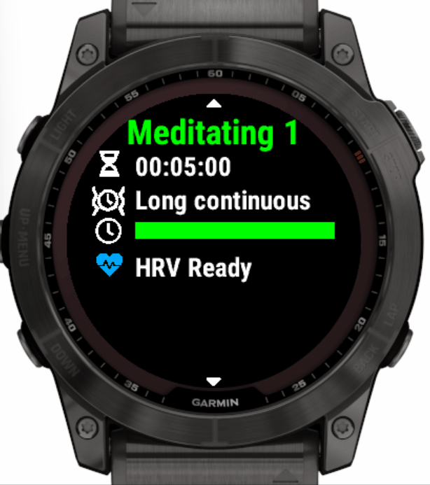
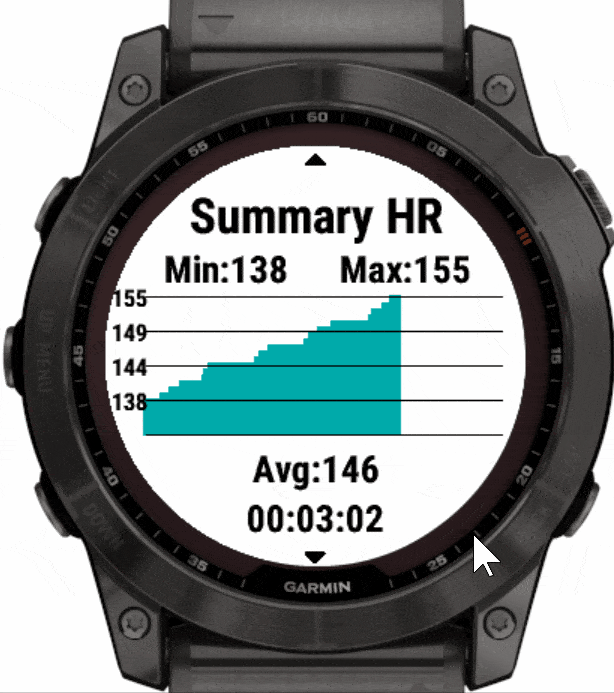
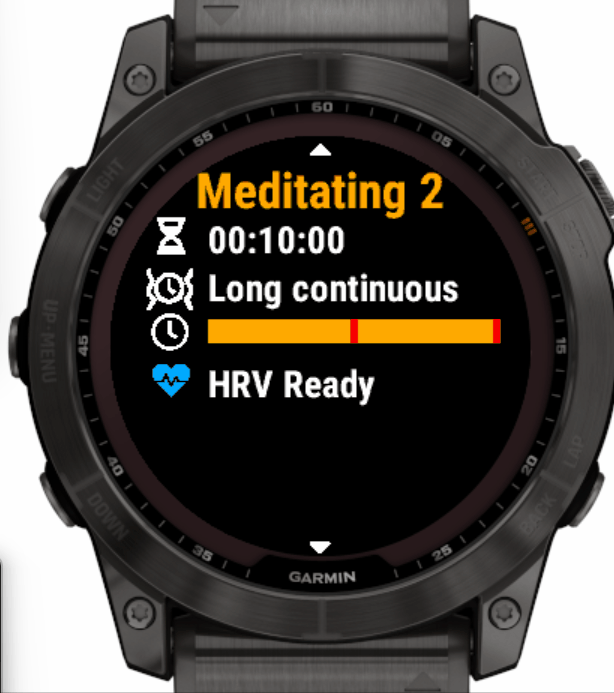
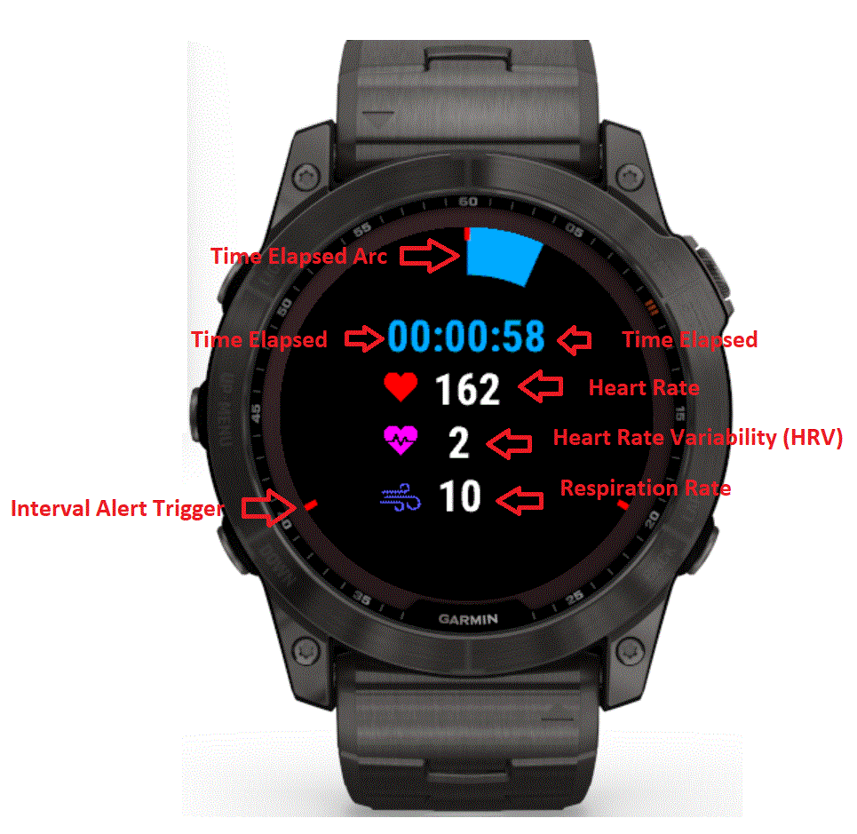
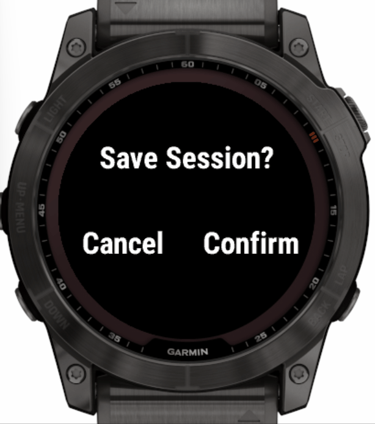
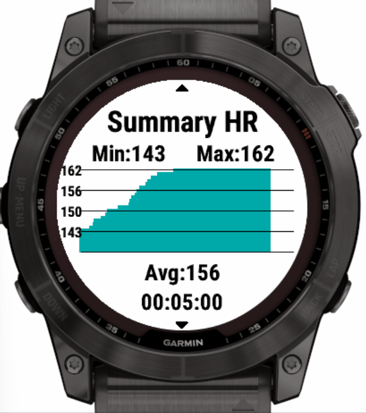
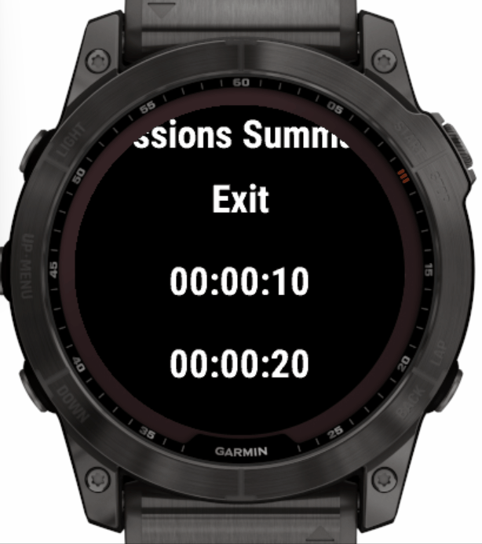
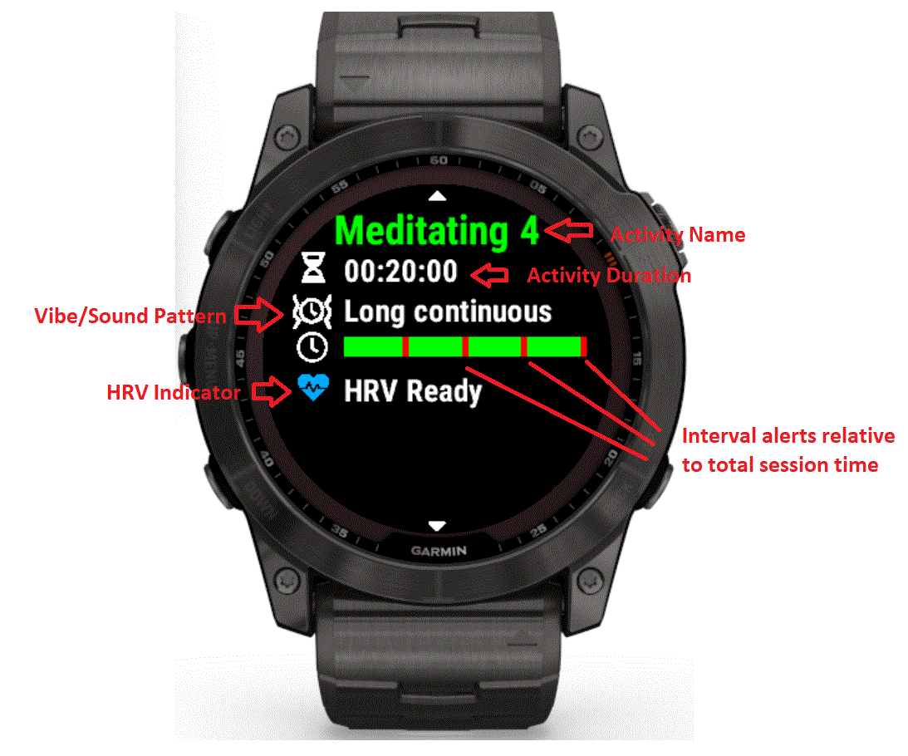
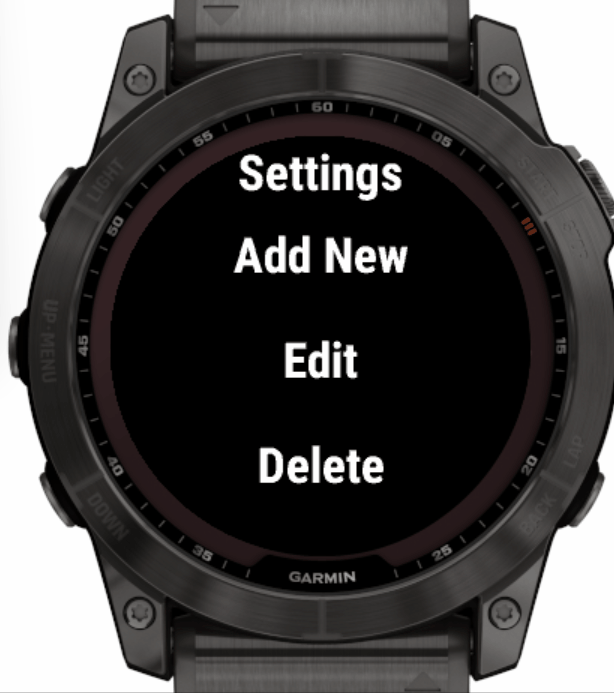
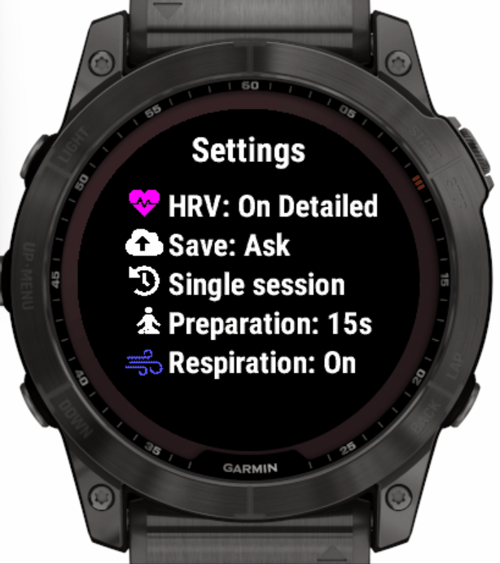

# Meditate Garmin App User Guide

## Features

- ability to save the meditation session as Garmin Connect activity
  - activity type **Meditation** or **Yoga** or **Breathwork**
- ability to configure multiple meditation/yoga/breathwork sessions
  - e.g. a 20 min session with 1 min recurring alerts, triggering a different alert on the 10th minute
  - each session supports interval vibration alerts
  - interval alerts can trigger from a few seconds up to few hours
- pre-configured default meditation & breathwork sessions
- [HRV](https://en.wikipedia.org/wiki/Heart_rate_variability) (Heart Rate Variability)
  - RMSSD - Root Mean Square of Successive Differences (beat-to-beat intervals)
  - pNN20 - % of successive beat-to-beat intervals that differ by more than 20 ms
  - pNN50 - % of successive beat-to-beat intervals that differ by more than 50 ms
  - beat-to-beat interval - reading coming directly from the watch sensor
  - HRV Successive Differences - difference between the current and previous beat-to-beat intervals
  - SDRR - [Standard Deviation](https://en.wikipedia.org/wiki/Standard_deviation) of beat-to-beat intervals
    - calculated from the first and last 5 min of the session
  - HRV RMSSD Window - RMSSD calculated for consecutive 60 second intervals
    - Window size can be adjusted to allow to switch between ultra-short-term and short-term HRV measure
  - HR from heartbeat - beat-to-beat interval converted to HR
- stress tracking
- respiration rate
  - Breathes per minute real time in watches that supports it
- configurable preparation and finish time before/after the session
- summary stats at the end of the session
  - charts including min, max, avg for heart rate, HRV, respiration, stress
  - stats screens for HRV, stress, and more
- pause/resume current session using the back button
- ability to configure default custom activity name in Garmin Connect using Garmin Express in PC connected to the watch via USB cable
  - ability to configure activity name on watch will come in a later release

## How to Use

### 1. Starting a session

1.1. From the session picker screen press the start button or touch the screen (touch devices only).
**To get good sensor readings you need to minimise wrist movement!**

1.2. The session in-progress screen contains the following elements

- time elapsed arc
  - shows the percentage of elapsed session time
  - full circle means session time has elapsed
- interval alert triggers
  - the small colored marks represent the time of trigerring an interval alert
  - each marked position corresponts to an alert trigger time
  - you can hide them per alert by selecting transparent color from the [Interval Alerts settings menu](#2-configuring-a-session)
- time elapsed
- current HR
- current HRV
- current respiration rate estimation calculated by garmin

The session finishes once you press the start/stop button.
The session can be paused/resumed using the back button.
Enable/disable screen light during the session using light button or touch the screen (touch devices only).

1.3. Once you stop the session you have the option to save it, which means it will show up in your garmin connect portal as activity after syncing your watch.

1.3.1 You can configure to auto save or auto discard the session via [Global Settings](#4-global-settings) -> [Confirm Save](#42-confirm-save)

1.4. If you are in single session mode (the default) at the end you see the Summary Screen (for Multi-Session mode see the next section **1.5**). Swipe up/down (touch devices only) or press page up/down buttons to see the summary stats of HR, Stress, HRV, and more. Press back on this view to exit the app.

1.5 If you are in multi-session mode (determined by [Global Settings](#4-global-settings) -> [Multi-Session](#43-multi-session)) then you go back to the session picker screen. From there you can start another session. Once you finish your session you can go back from the session picker screen to enter the Sessions Summary view.

1.6 From the Sessions Summary view you can drill-down into individual sessions or exit the app. Drilling-down shows detailed summary stats of the session. If you go back from the Sessions Summary view you can continue doing more sessions.

### 2. Picking a session

From the session picker screen press page up/down buttons (for touch devices swipe up/down).
On this screen you can see the applicable settings for the selected session

- activity type - in the title
  - Meditate
- time - total duration of the session
- vibe pattern
- interval alert triggers - the graph in the middle of the screen represents the relative alert triger time compared to the total session time
- HRV indicator
  -  Off - indicates that stress and HRV are turned off
  -  Waiting HRV
    - the hardware sensor does not detect HRV
    - you can start the session but you will have missing HRV data, it is recommended to stay quiet until HRV is ready
  -  HRV Ready
    - the hardware sensor detects HRV
    - the session tracks default HRV and Stress metrics
    - **the session can be recored with reliable HRV data provided you minimize wrist movement**
  -  HRV Ready
    - the hardware sensor detects HRV
    - the session tracks extended HRV and Stress metrics
    - **the session can be recored with reliable HRV data provided you minimize wrist movement**

2.1 Breathwork introduction

The app comes with 3 pre-configured breathwork sessions. The following gives a short introduction to each of them. A full breathcycle consists off the following 4 elements, from wich some might be skipt depending on the breath pattern: Inhale, Hold, Exhale, Hold (cycle starts from the beginning). The inhale is recommended through the nose, while the exhale should be done through the mouth.

2.1.1 Box-Breathing

Box breathing refers to the technique where each element of the breath cycle as an equal time. That's also where the name is coming from: Think of a box with 4 equal edges. You start with 4 seconds inhale, hold your breath for 4 seconds, exhale for 4 seconds, hold for 4 seconds, and start again with inhaling. Box-breathing is helpful to calm yourself down.

2.1.2 Coherence breathing

This one is even simpler. You just inhale for 5 seconds, exhale for 5 seconds, and repeat. The aim of (heart) coherence breathing is to increased overall HRV values.

2.1.3 4-7-8 breathing

This is a typical technique to calm your self down and prepare for sleep. You start by a 4 second inhale, hold your breath for 7, and exhale for 8 seconds.

2.1.4 Tips for breathwork:

- The general rule of thumb for calming your self down is exhale twice as long as you inhale. Sometimes it's easier to not stress yourself out additionally but forcing yourself to some timed pattern - just find your own rythm and try to exhale longer than you inhale. In general, the slower your breath, the calmer your body and mind. If you are able to arrive at One-breath-per-minute, you will notice that stress, anxiety, and many other things just resolve and disappear. So just try to breath slower and slower with every cycle and sessions and watch you your body relaxes itself.
- The pre-configured sessions are great, but sometimes also stressful - it's just hard to get it exactly right. If this is overhelming for you, I recommend to just do a normal session without intervals and follow the rule of thumb above.
- To extend your exhale, it is helpful if you don't open up your mouth too much. Think of slightly pressing the air through your lips - the air opens the lips, not the muscle around your mouth or of your jaw - keep your facial muscles relaxed. This natural resistance to your exhale makes it easier to have long and calm exhales.

  2.2 Interpreting the stats of your session

- HRV: heart rate variability refers to how inconsistent the time between your heart beats is. Yes, this sound scary at first, but is very natural and actually a high variability (low consistency in time between heartbeats) signals a calm body and mind. You can think of this the following way: If you are stressed, your heart goes like "I need to beat now! now! now! now!" - super stressful! If you are calm, your heart goes like "Maybe I should beat now, aah that was good, I think it might do another beat soon."
- Stress: naturally lower stress is great. Anything below 20 is already a great start - I'm sometimes able to reach 0 if I lay myself flat on the ground on a yoga mat and put my hands above my hand on the ground (I've noticed this position opens up my breast, which allows for more space for my heart to unfold and relax. This also spikes HRV far above 100 for me.)
- Respiration: Lower is great, however, the measurements provided here from garmin I've found to be not very reliable. They might be great for active sports, but for these calm things it doesn't work well.
- Heart rate: Again, lower is better. You will notice that your heart rate greatly correlates with stress and good HRV values.

### 3. Configuring/Customizing a session

3.1 From the session selection screen hold the menu button (middle left) until you see the Session settings menu.

- for touch screen supported devices, it is also possible to touch and hold on the screen

3.2 In Add New/Edit you can configure:

- Time - total duration of the session in H:MM
- Color - the color of the session used in graphical controls; select by using page up/down behaviour on the watch (Vivoactive 3/4/Venu - swipe up/down)
- Vibe Pattern - shorter or longer patterns ranging from pulsating or continuous
- Interval Alerts - ability to configure multiple intermediate alerts
  - once you are on a specific interval alert you see in the menu title the Alert ID (e.g. Alert 1) relative to the current session interval alerts
  - Time
    - select one-off or repetitive alert
    - repetitive alerts allow shorter durations than a minute
    - only a single alert will execute at any given time
    - priority of alerts with the same time: final session alert, last one-off alert, last repetative alert
  - Color - the color of the current interval alert used in the graphical controls. Select different colors for each alert to differentiate them during meditation. Select transparent color if you don't want to see visual marks for the alert during meditation
  - Offset - the offset of the current interval alert. e.g., if you set this to 30sec for a 10sec interval alert, the interval will start after the first 30sec of the session.
  - Vibe Pattern/Sound - shorter or longer patterns ranging from pulsating or continuous or sound
- Activity Type - ability to save the session as **Meditation** or **Yoga** or **Breathwork**. You can configure default activity type for new sessions from the Global Settings ([see section 4](#4-global-settings)).
- HRV Tracking - determines if HRV and stress are tracked

  - ON - tracks stress and the following HRV metrics
    - RMSSD
    - HRV Successive Differences
  - On Detailed (Default) - tracks extra stress and HRV metrics in addition to the **On** option

    - RMSSD
    - HRV Successive Differences
    - pNN20
    - pNN50
    - beat-to-beat interval
    - SDRR First 5 min of the session
    - SDRR Last 5 min of the session
    - RMSSD Window
    - HR from heartbeat

- Name - (new) You can give a session a custom name in the Add New / Edit flow. On the watch open Add New or Edit, select the "Name" entry and enter text using the platform TextPicker. The session name supports the `[time]` placeholder which will be replaced by the session duration when exporting the activity (for example: "Deep rest [time]").

  - If you want that session name to show up as the activity name in Garmin Connect after syncing, enable the Global Setting described in [section 4.9](#4.9-use-session-name-as-activity-name).

    3.3 Delete - deletes a session after asking for confirmation

    3.4 Global Settings - [see section 4](#4-global-settings)

    3.5 Configure custom breathwork session

Breathwork sessions typically follow some pattern of Inhale, Hold, Exhale, Hold. As all the configured interval alerts run in parallel, you need to use the offset to create such a pattern. For example, to configure 4 Inhale, 7 Hold, 8 Exhale you'd need to do the following:

- Calculate the total duration of one breath cycle: 4 + 7 + 8 = 19sec.
- Create 3 interval alerts with the following settings:
  - Inhale: Time=19; Offset=0 (recommended vibe pattern: ShortAscending to signal inhale)
  - Hold: Time=19; Offset=4 (recommended vibe pattern: ShortContinous to signal holding)
  - Exhale: Time=19; Offset=11 (4+7) (recommended vibe pattern: ShortDescending to signal exhale)

### 4. Global Settings

From the session picker screen hold the menu button (or touch and hold the screen) until you see the Session settings menu. Select the Global Settings Menu. You see a view with the states of the global settings. Hold the menu button again (or touch and hold the screen) to edit global settings.

#### 4.1 HRV Tracking

This setting provides the default **HRV Tracking** for new sessions.

- **On** - tracks default HRV metrics and Stress
  - RMSSD
  - Successive Differences
  - Stress
- **On Detailed** - extended HRV and Stress metrics
  - RMSSD
  - Successive Differences
  - Stress
  - beat-to-beat interval
  - pNN50
  - pNN20
  - HR from heartbeat
  - RMSSD Window
  - SDRR First 5 min of the session
  - SDRR Last 5 min of the session
- **Off** - HRV and Stress tracking turned off

#### 4.2 Confirm Save

- Ask - when an activity finihes asks for confirmation whether to save the activity
- Auto Yes - when an activity finihes auto saves it
- Auto No - when an activity finihes auto discards it

#### 4.3 Multi-Session

- Yes
  - the app continues to run after finishing session
  - this allows you to record multiple sessions
- No - the app exits after finishing session

#### 4.4 Preparation time

- 0 seg - No preparation time
- 15 seg (Default) - 15s for preparing before starting the meditation session
- 30 seg - 30s for preparing before starting the meditation session
- 60 seg - 1min for preparing before starting the meditation session

#### 4.5 Respiration Rate (note: some devices don't support this feature)

- On (Default) - Respiration rate metrics enabled during session
- Off - Respiration rate metrics disabled during session

#### 4.6 New Activity Type

You can set the default activity type for new sessions.

- Yoga
- Meditation
- Breathwork

#### 4.7 HRV Window

You can change over which time-window the HRV is calculated. For reliable measurements I recommend going for at least 3min, as everything below is considered ultra-short-term HRV measurement. Personally, I use 5min for my sessions. The default is 60sec, because beginners tend to do session around 5min and still want to see some trend of their HRV within this window. Read more on this topic [here](https://pmc.ncbi.nlm.nih.gov/articles/PMC5624990/)

#### 4.8 Notifications

Enables or disables any notifications from the app. If set to off, you won't get any interval alerts or final alerts.

#### 4.9 Use session name as activity name

This option controls whether the custom session name you set for a session is used as the activity name that appears in Garmin Connect after syncing. The setting is available under Global Settings on the watch and is called "Session name = Activity name". The default is **No (Default)**.

- If enabled and the session has a custom name, that name will be used when creating the activity name. You can include the placeholder `[time]` in the session name — it will be replaced by the session duration (for example, "Deep rest [time]" becomes "Deep rest 20min").
- If the session name is empty or the setting is disabled, the app falls back to the Garmin Connect activity name configured via Garmin Express or the built-in default titles (for example, "Meditating 🧘").
- Note: the activity name is truncated to 21 characters to fit Garmin's display limits.

#### 4.10 Sensor restart

Select this option when the optical heart rate sensor or a connected external sensor stops providing heart beat intervals. The app disables every HR-capable sensor and exits so the watch firmware can reinitialize them cleanly. After triggering the restart, reopen Meditate, keep the watch still for about 30 seconds, and then start your session.

## FAQs

### HRV does not work / shows "waiting"

1. Close and reopen the app - wait at least 30sec - don't move!
2. Open Global Settings and pick "Sensor restart". The app will exit after shutting down all heart rate sensors. Reopen the app, wait 30sec, and keep your wrist still.
3. If you are NOT using any external heart rate sensor (e.g., hr chest strap) for the session, go to the connectivity settings of your watch (not the settings in the app!) and make sure all external sensors are disconnected and set to off (so they don't automatically and silently connect in the background when starting a session and mess up your heart rate readings). E.g., You just came home from a run, and the chest strap is still somewhere close by, the watch would automatically connect to it again even if you don't wear the chest strap/it's in standby mode/it's charging.
4. Make sure your sensor is correctly positioned on your wrist. If you adapt the position, hold still and give it 30sec until the readings become stable.
5. Reinstall the app
6. If you don't get reliable readings or wrong readings, you might want to try to position the sensor on the inside of your wrist, or use an external heart rate sensor that supports heart beat intervals. If you are using an external sensor, please make sure to activate "External Sensor" in the global settings and restart the app.

### Can I change the name of the session on the watch

Yes. You can edit a session's name from the Add New / Edit flow on the watch: select the "Name" entry and enter text using the platform TextPicker (see section 3.2). If you want the session name to be used as the activity name in Garmin Connect, enable the Global Setting described in section 4.9.

### The app crashes the moment I start a session - what can I do?

If the app opens up, but crashes the moment you start a session, it is very likely that your model does not support the selected activity type. Please edit the session and try to use a different activity type. "Generic" should work on all models.

### The app does not track stress

Not all devices support continous stress tracking. (e.g., older models like the [Fenix 5X do not support this - it only support snapshot stress measurements](https://www8.garmin.com/manuals/webhelp/fenix5x/EN-US/GUID-20E035CE-CA52-40D0-B202-13403D6FAA51.html)).

#### But the [old version](https://apps.garmin.com/en-US/apps/c5fc5ea5-7d12-4fb9-be9c-701663a39db7) supported stress tracking

The old version used an own algorithm for estimating stress - this new version of the app uses the built-in stress tracking provided by garmin. I frequently got the question why stress did not match with the built-in stress measurement, so I decided to just reuse what is already there.

### The respiratory rate (breaths per minute) is off

This is not specific to this app and there is nothing I can do about this. The app only uses whatever the Garmin sensor provides. You may be able to improve this by using a chest strap that supports HRV and respiratory rate reporting (e.g., hrm-600)

### The app stopped working / I need support

Please be respectful of my time and try these steps before you reach out for support:

- Restart the app
- Update the app
- Reinstall the app
- Reboot your watch

Please include the following information when reaching out for support:

- Steps you have already taken (e.g., reinstall of the app)
- When did it stop working? After a recent app update, after a recent watch firmware update, ...
- Does this feature work with the [old version of this app](https://apps.garmin.com/en-US/apps/c5fc5ea5-7d12-4fb9-be9c-701663a39db7)?

You can reach out to me using the "Contact Developer" link in the Garmin Connect IQ portal.

[Data Privacy Policy](/meditate_app_data_privacy)
